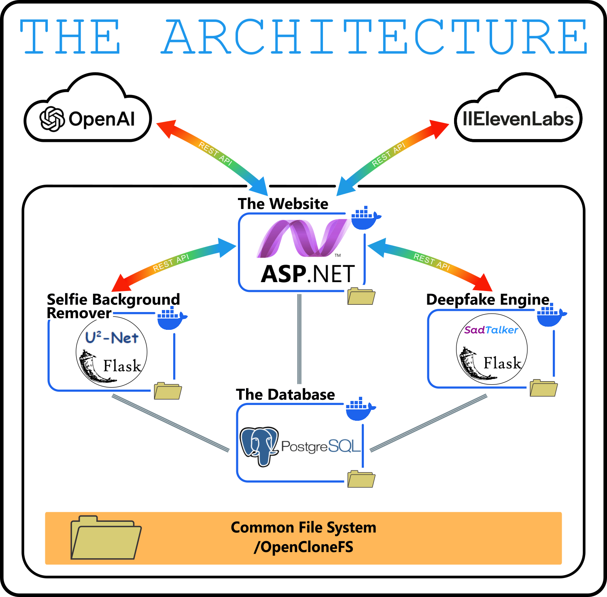
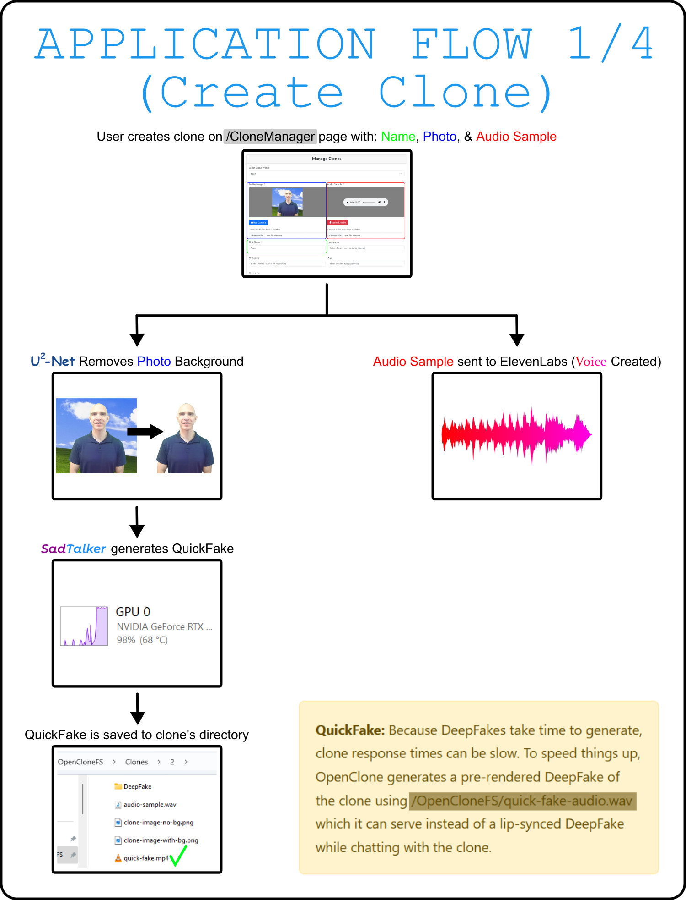
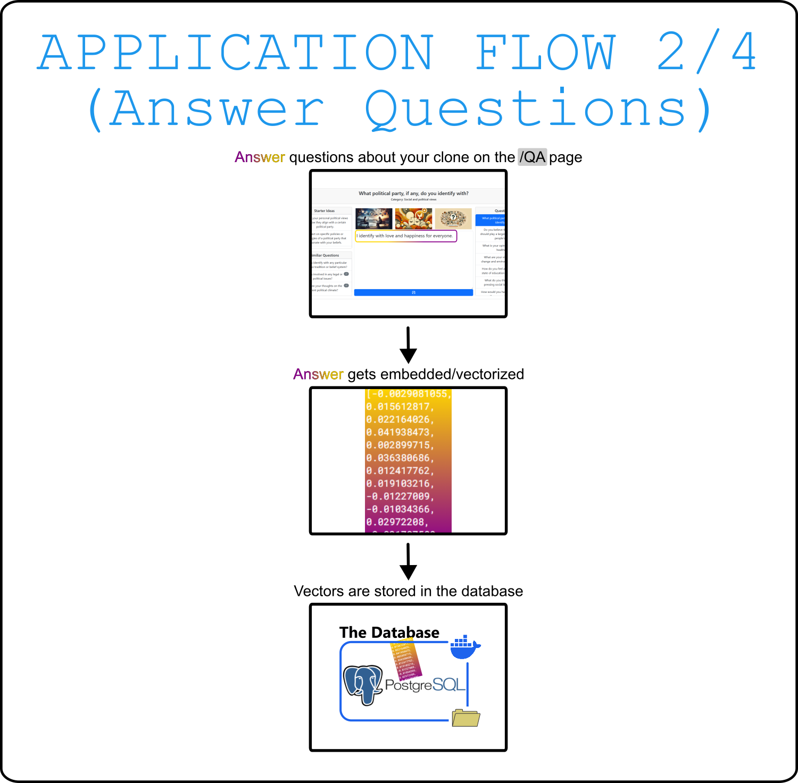
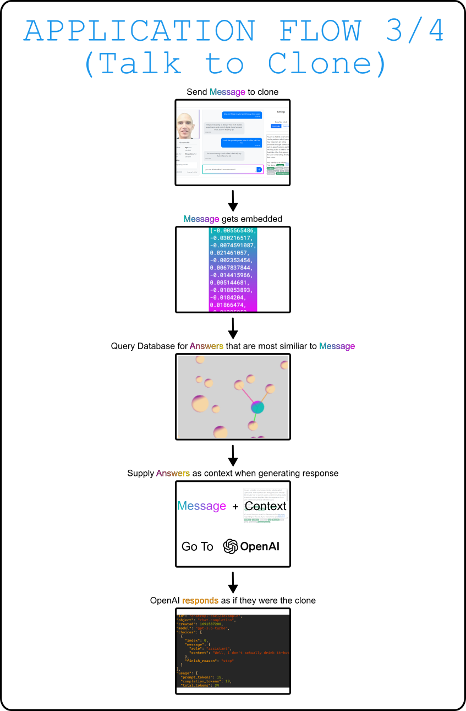
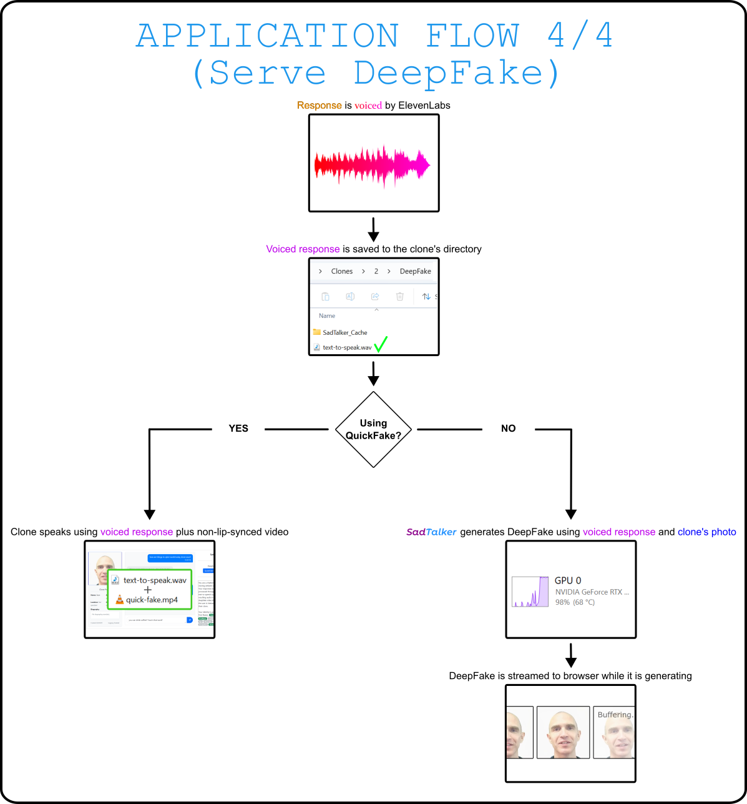

# OpenClone

## What Is OpenClone

Create real-time deepfake responses of a person using their photo, audio sample, and their bio + Q/A.

### Live Demo
[https://clonezone.me](https://clonezone.me)

## Video Demonstration

## Why Is OpenClone

It's quite obvious to me that clones like these will be common at some point in the future. It will be a huge industry:

- Talk to ancestors
- "Reincarnation" of sorts
- Yourself, as an agent
- Dating speed runs
- Modern-day answering machines

Now ask yourself, do you want Meta to be the one cloning you? Do you want to give all of your information over to some company in the typical way? They pay you lip service while collecting your data and using it however they want. That sounds awful and deeply disrespectful when the subject matter is one's identity. Therefore, I propose OpenClone. Data is fully exportable and user-owned, privacy is the default, and the code is open source.

## How Is OpenClone

## Application Logic

OpenClone is a platform. The basics are taken care of:

- Accounts and Authorization
- Microservice Architecture
- Complete ASP.NET/React website pattern
- Base Entity Framework data model ready for expansion
- Real-time rich-text logging framework

The base logic of OpenClone looks like this:

 

## Component Overview

- **[Website](/Website)** - OpenClone's interface and logic.
- **[Database](/Database)** - Contains an application database, a logging database, and environment bootstrap functionality.
- **[SadTalker](SadTalker)** - A REST API wrapped around the SadTalker (https://github.com/OpenTalker/SadTalker) deepfake project.
- **[U-2-Net](/U-2-NET)** - A REST API wrapped around the U-2-Net (https://github.com/xuebinqin/U-2-Net) background remover project.
- **Logging** - [LogWeaver](/LogWeaver/) (Python) and [OpenClone.Core.Logging](/Website/OpenClone.Core/Services/Logging/) (C#) log to the same database. Viewable in real time with [LogViewer](/LogViewer/).
- **[Deployment](/Deployment/)** - Can be deployed as a Vultr Kubernetes cluster or self-hosted.
- **[Start/Stop Scripts](/StartStopScripts/)** - Batch scripts make it easy to turn the various applications on.

## How to Run

1. Set [environment variables](Documentation/EnvironmentVariables.md)
2. Run `StartStopScripts/Database/restore.bat` to setup environment
3. Run `StartStopScripts/run-all.bat` to start everything

## 🤖 **Claude Code Integration** 🤖

Claude has special OpenClone integrations defined in its various CLAUDE.md files:
- Claude can see your most recent screenshot.
- Ask Claude to summarize what you worked on to [Session Memory](/StartStopScripts/Claude/SessionMemory/). It's sort of like the story of your application. *This feature was added late in the development of OpenClone so most of the "story" is not there*.
- [StartStopScripts/Claude/start.bat](StartStopScripts/Claude/start.bat) will launch Claude along with a shared tmux terminal for pair programming.
- Nested CLAUDE.md files provide knowledge about each project

## Lies

For simplicity, I have told you a few [lies](/Documentation/lies.md). 
